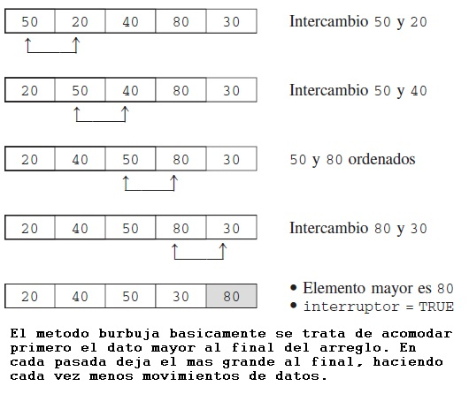

# Estructura-de-datos-TP1
Busqueda y ordenamiento en Python

Primer trabajo practico de la materia Estructura de datos de la carrera Licenciatura en Informatica, Universidad Nacional de Hurlingham.
En este primer acercamiento al lenguaje Python se trabajo con arreglos y recursividad, comprendiendo los principios de ordenamiento y busqueda. 
Se focalizo en el ordenamiento tipo burbuja, y su comparacion de eficiencia con otros metodos, y la busqueda binaria.

